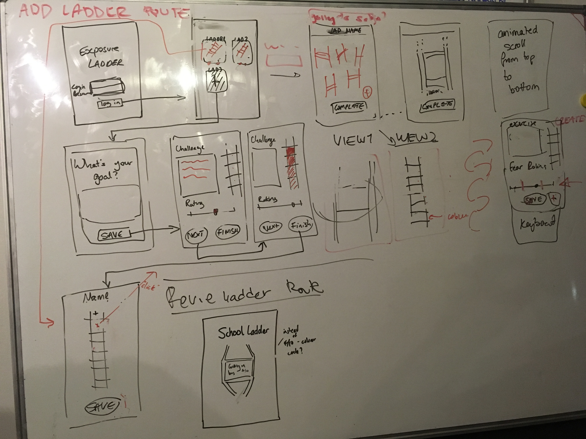

# Anxiety-ladder

## Description

A web app for managing anxiety through practise of exposure ladders

There are two key *user journeys*; ladder creation and ladder reviewing.

### Ladder creation

#### User Journey

As a young person suffering from anxiety...  
I want to create an exposure ladder...  
So that I can visualise achievable steps to tackle my anxiety...  

#### User stories
As a young person suffering from anxiety...  

I want to see a friendly landing page...  
So that I feel comfortable facing my fears and encouraged to use the app...  

I want to log into my account...  
So that I can see MY ladders with ownership...  

I want to create an empty ladder which represents an anxiety related goal...  
So that I can fill it with broken down steps...  

I want to be able to create multiple ladders for different anxiety related goals...  
So that I can work towards multiple anxiety related goals...  

I want to see a greyscale ladder with a plus as the placeholder for new ladder functionality...  
So that it's obvious that I am able to create many ladders...  

I want to create individual steps for each ladder...  
So that I have actionable steps to focus on and review...  

As a young person suffering from anxiety creating a ladder without guidance...  
I want to get advise/tips on how to break my fear down into steps...  
So that I am able to complete my ladder independently...  

I want to give each step a fear rating...  
So that my steps can be ordered so that I know which to tackle at any time...  

I want to rate each step in a non-numerical way...  
So that my rating is less calculated and more instinctive and hence doesn't cause added anxiety...  

I want to be able to save my steps as I go...  
So that I don't loose my progress if I stop half way through...  

I want to see a completed/finish option...  
So that I'm sure my finished ladder is saved so that I can return to it...  

I want two options displayed for each ladder, an edit and a review button...  
So that I can edit an existing ladder...  

I want to receive encouragement after creating my ladder...  
So that I feel empowered to begin tackling the first step...  

I want to be able to logout...  
So that I am sure my ladders are secure and private...  

### Reviewing ladder

#### User Journey

As a young person suffering from anxiety...  
I want to regularly review my anxiety level after an exposure...  
So that I can update my progress and overcome my anxiety...  

#### User stories

As a young person suffering from anxiety...  

I want to navigate to a specific exposure exercise in a minimum number of steps...  
So that I can review the exposure exercise as easily as possible...  

I should be able to remain logged in by default...  
So that I can review the exposure exercise as easily as possible...  

As a young person suffering from anxiety, who feels like they need extra support...  
I want an option to automatically notify a person of my choice on a dramatic fear change...  
So that a I feel more confident to tackle my exposure exercises (independently)...  

I want the app to update an admin/clinician dashboard...  
So that my clinician is able to view my real time progress and hence become more informed the next session...  

I want the previous exposure rating to be visible whilst re-rating...  
So that I can re-rate my exposure relative the the previous rating...  

I want have the option to signal that I am about to try an exercise and receive a notification some time after...  
So that I am reminded to review an exposure exercise I recently attempted...  

I want a comforting message to be displayed once I signal start...  
So that I feel calmer before an exposure exercise...  

I want to have an input field when reviewing an exercise...  
So that I can reflect and record the experience in my own words...  

I want an input field for time...   
So that I can record the how long my exposure lasted for...    

I want to see motivating messages after each step and congratulatory messaged after completing a ladder...  
So that my bravery is encouraged...  

I want a cancel button to appear after clicking start...  
So that I can easily cancel my attempt and hence prevent review notification...  

I want a back button which leads to a page with all ladders displayed...  
So that i can navigate between ladders...  

I want to be able to scroll up the steps and visualise one to three at a time...  
So that I'm not intimidated by all the steps on a ladder...  

I want to only see one set of action buttons for the step in focus...  
So that the reviewing screen is as simple as possible...  

## Storyboard

