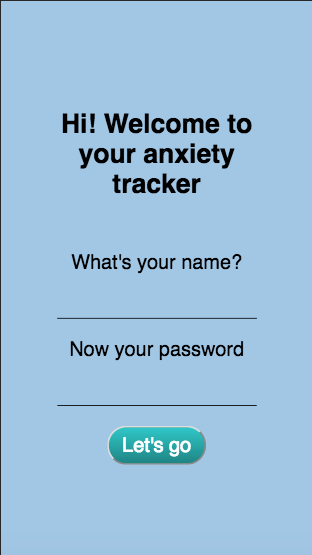
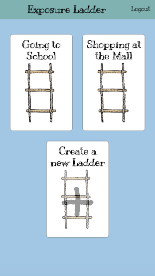
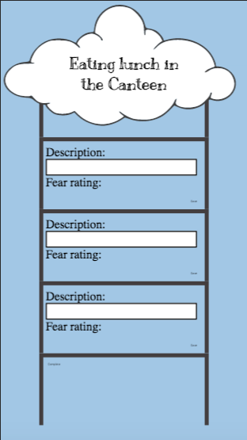

# Anxiety-ladder

## Description

A web app for managing anxiety through practise of exposure ladders

There are three key *user journeys*; ladder creation, ladder reviewing, and progress tracking.

## Tech Stack

### Current Tech Stack
- Html static files
- Vanilla CSS
- JS with ES6
- animate css (library)

### MVP Tech Stack
- Database: PostgreSQL
- Server: Node.js Hapi (with hapi authentication)
- React for server-side rendering
- Redux state management
- CSS
- animate css (library)
- Client-side JS (animations)

### Ladder creation

#### User Journey

As a young person suffering from anxiety...  
I want to create an exposure ladder...  
So that I can set up, structure and prepare my exposure practice ...  

#### User stories
As a young person suffering from anxiety...  

I want to see a friendly landing page...  
So that I feel comfortable facing my fears and encouraged to use the app...  

I want to log into my account...  
So that I can see MY ladders with ownership...  

I want to create an empty ladder which represents an anxiety related goal...  
So that I can fill it with related broken down steps by describing anxiety provoking, challenging situations that are related to the goal...  

I want to be able to create multiple ladders for different anxiety related goals...  
So that I can work towards multiple goals...  

I want to see a greyscale ladder with a plus as the placeholder for new ladder functionality...  
So that it's obvious that I am able to create many ladders...  

I want the goals showing a distinct feature,
so that once I start adding challenging situations I know which goal I am working with

I want to create individual steps for each ladder by inserting challenging situations related to the goal...  
So that I have actionable steps to focus on and review...  

I want to get advise/tips on how to break my goal down into steps...  
So that I am able to complete my ladder independently...  

I want to give each challenging situation a rating of the anticipated distress that this situation will cause me...  
So that my steps can be ordered so that I know which to tackle at any time...  

I want to rate each step in a numerical and a non-numerical way...  
So that I can choose between a rating that is less calculated and more instinctive and hence doesn't cause added anxiety whilst at the same time I will be able to make a numerical judgement if I want to...  

I want to be able to save my steps as I go...  
So that I don't loose my progress if I stop half way through...  

I want to see a completed/finish option...  
So that I'm sure my finished ladder is saved so that I can return to it...  

I want two options displayed for each ladder, an edit and a review button...  
So that I can edit an existing ladder...  

I want to recognise in which ladder I am adding challenging situations by seeing  the distinct feature (color/symbol),
So that I can focus on working on one particular goal...

I want to receive encouragement after creating my ladder...  
So that I feel empowered to begin tackling the first step...  

I want to be able to logout...  
So that I am sure my ladders are secure and private...  

### Reviewing ladder

#### User Journey

As a young person suffering from anxiety...  
I want to document my observed experience during exposure practice and regularly review my experienced anxiety level before and after an exposure...  
So that I can update my progress and overcome my anxiety by learning that my emotional response can change with exposure practice...  

#### User stories

As a young person suffering from anxiety...  

I want to navigate to a specific exposure exercise in a minimum number of steps...  
So that I can review the exposure exercise as easily as possible...  

I should be able to remain logged in by default...  
So that I can review the exposure exercise as easily as possible...  

As a young person suffering from anxiety, who feels like they need extra support...  
I want an option to add a contact of a person of my choice to receive help, encouragement and support if I feel I would like to...  
So that a I feel supported and more confident to tackle my exposure exercises (independently)...  

I want to be able to update an admin/clinician dashboard/export my exposure ladder and the outcome data...  
So that I can decide when I want to share my progress with my clinician who is able to view my progress and hence become more informed the next session...  

I want have the option to signal that I am about to try an exercise and receive a notification some time after...  
So that I am reminded to review an exposure exercise I recently attempted...  

I want a comforting message to be displayed once I signal start...  
So that I feel calmer before an exposure exercise...  

I want to have an input field when reviewing an exercise...  
So that I can reflect and record the experience in my own words...  

I want an input field for time...   
So that I can record the how long my exposure lasted for...    

I want to see motivating messages after each step and congratulatory messaged after completing a ladder...  
So that my bravery is encouraged...  

I want a cancel button to appear after clicking start...  
So that I can easily cancel my attempt and hence prevent review notification...  

I want a back button which leads to a page with all ladders displayed...  
So that i can navigate between ladders...  

I want to be able to scroll up the steps and visualise one to three at a time...  
So that I'm not intimidated by all the steps on a ladder...  

I want to only see one set of action buttons for the step in focus...  
So that the reviewing screen is as simple as possible...  

### Outcome Monitoring

#### User Journey
As a Young person with anxiety..
I want all my exposure rating to be visible in a diagram...  
So that I can track my progress and receive feedback if my work leads me towards my goals...

#### User Stories
As a Young person with anxiety..
I want all my exposure rating to be visible in a diagram...
So that I can track a difference between 'before' and 'after' exposure ratings...  

As a Young person with anxiety..
I want all my exposure rating to be visible in a diagram...
So that I can track a difference between exposure sessions...  

As a Young person with anxiety..
I want all my exposure rating to be visible in a diagram...
So that I can receive feedback about different challenging situations related to one goal at the same time...  

## Storyboard

## Screen grabs of progress Wed 1st

